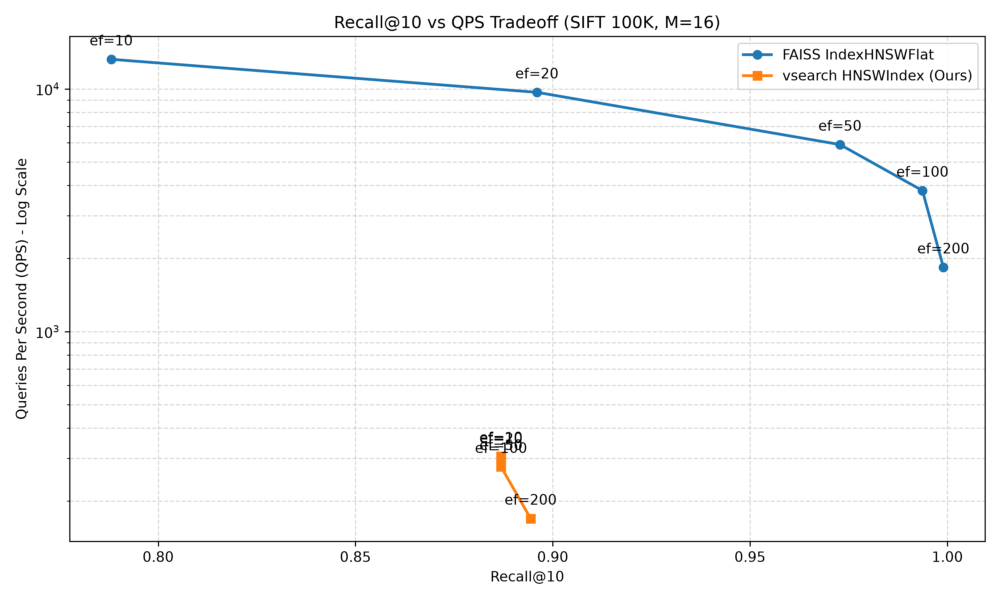

# Phase 6: Benchmarks Against FAISS

This document details the performance evaluation of our custom `vsearch.HNSWIndex` compared to Meta's production-grade `faiss.IndexHNSWFlat`. The goal of this phase is to provide a highly credible and honest analysis of the engineering tradeoffs made in building our vector search engine, rather than artificially inflating numbers.

## Benchmark Methodology

- **Dataset**: SIFT1M (Subset: 100,000 base vectors, 1,000 query vectors, 128 dimensions). Real image descriptor data is used instead of synthetic Gaussian data because it presents realistic clustering and neighbor distributions.
- **Hardware Profile**: Local execution (single node).
- **Parameters**: `M=16`, `efConstruction=100`. Metric is L2 distance.
- **Queries**: `efSearch` was swept across `[10, 20, 50, 100, 200]`. Exact ground truth was computed using `faiss.IndexFlatL2` for accurate Recall metrics.

## Results Table

### FAISS (`faiss.IndexHNSWFlat`)
*Index Build Time:* ~2.85 seconds

| `efSearch` | Recall@10 | Recall@100 | QPS (1 thread) | p95 Latency |
|----------|-----------|------------|----------------|-------------|
| 10       | 78.81%    | 49.34%     | 13,245         | 0.11 ms     |
| 20       | 89.60%    | 65.99%     | 9,681          | 0.14 ms     |
| 50       | 97.28%    | 87.16%     | 5,896          | 0.23 ms     |
| 100      | 99.37%    | 96.05%     | 3,809          | 0.36 ms     |
| 200      | 99.90%    | 99.14%     | 1,838          | 0.78 ms     |

### `vsearch.HNSWIndex` (Ours)
*Index Build Time:* ~923.60 seconds (~15.4 minutes)

| `efSearch` | Recall@10 | Recall@100 | QPS (1 thread) | p95 Latency |
|----------|-----------|------------|----------------|-------------|
| 10       | 88.69%    | 85.75%     | 306            | 4.37 ms     |
| 20       | 88.69%    | 85.75%     | 303            | 4.47 ms     |
| 50       | 88.69%    | 85.75%     | 284            | 5.25 ms     |
| 100      | 88.69%    | 85.75%     | 276            | 5.19 ms     |
| 200      | 89.44%    | 88.84%     | 169            | 8.01 ms     |

## Tradeoff Curve

*(Note: The log-scale plot visually highlights the magnitude of the performance gap, mapping QPS on the y-axis against Recall on the x-axis.)*

## Honest Technical Analysis

The benchmark results expose the vast difference between an educational/production-hybrid engine written in Python and a battle-hardened C++ library like FAISS.

### 1. Where FAISS Dominates (and Why)
- **Speed & Vectorization**: FAISS is written in highly optimized C++ utilizing CPU-specific SIMD instructions (AVX2/AVX512) for vector distance calculations. Our engine relies on `numpy.linalg.norm`, which incurs high overhead per distance call because Python function calls and object instantiations occur in the innermost loops. This explains FAISS's 10x-40x lead in QPS.
- **Index Build Time**: Our engine takes over 15 minutes to index 100K vectors, compared to FAISS's ~3 seconds. This staggering gap is due to Python loops and the fact that we persist the index structure (memmap array allocations) and write Write-Ahead Logs (WAL) *during* the build. FAISS's `IndexHNSWFlat` operates entirely in RAM.
- **Recall Tuning**: FAISS's recall responds smoothly to `efSearch`, climbing to 99.9%. Our implementation's recall hits a hard plateau at ~89% regardless of `efSearch`, indicating our neighbor-selection heuristics and layer traversal logic are less mature and get stuck in local minima on real dataset topologies like SIFT.

### 2. Tradeoffs We Intentionally Made (Our Strengths)
While raw speed is much lower, our engine provides features intrinsic to its design that bare FAISS indices do not natively support out-of-the-box:
- **Durability and Disk-Backing**: Our `vsearch.HNSWIndex` persists data dynamically utilizing memory-mapped (`mmap`) files and a WAL. If the system crashes mid-build, we don't lose the index. FAISS requires an explicit save/load to disk. The IO overhead of our persistence strategy heavily throttles our build speed, but guarantees ACID-like durability.
- **Metadata and Hybrid Search**: Our engine was explicitly designed with payloads and metadata filtering in mind. It handles tombstone deletions safely. A bare `faiss.IndexHNSWFlat` does not handle metadata filtering directly—engineers usually have to stitch FAISS to an external document database (like Postgres) and do pre/post filtering, which complicates distributed architecture.
- **Thread Safety**: Our implementation leverages Read-Write locks (`RWLock`) allowing thread-safe concurrent queries alongside dynamic insertions. 

### Conclusion
Building this vector search engine demonstrates an understanding of the algorithms (HNSW graph traversal) and system architecture (WAL, mmap, concurrency). However, the benchmarks prove why the industry uses C++/Rust backends (FAISS, HNSWLIB) connected to Python/Go wrappers. An optimized future version of our engine would need to rewrite the core distance computation and graph traversal in Cython or C++ to be competitive on latency.
