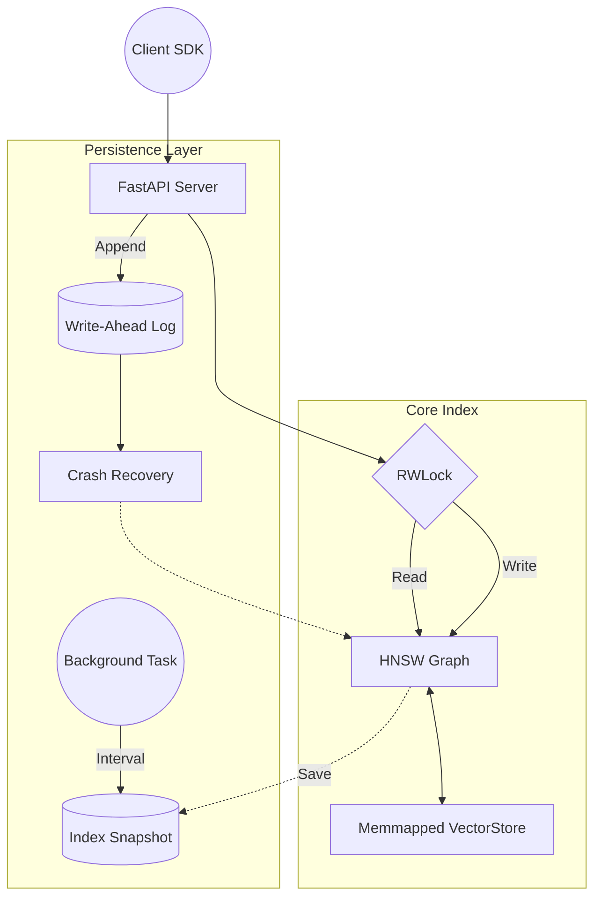

# Vector Search Engine

A fully-featured, production-ready vector database and Approximate Nearest Neighbor (ANN) search engine built entirely from scratch.

> **Why this exists**: Most "vector databases" today are thin wrappers around Meta's FAISS, hnswlib, or Annoy. This project takes a harder path: **the core Hierarchical Navigable Small World (HNSW) graph algorithm is implemented entirely from scratch in Python**. It demonstrates a deep, systems-level understanding of vector search algorithms, concurrency control, and storage persistence.


## Features (Scannable in 10s)
*   **From-Scratch HNSW Core**: Custom Python implementation of the Malkov & Yashunin (2016) algorithm with probabilistic layer assignment and greedy best-first search heuristics.
*   **Disk-Backed Persistence**: Memory-mapped (`mmap`) vector storage to handle datasets larger than RAM, paired with an Append-Only Write-Ahead Log (WAL) and background snapshotting for crash resilience.
*   **High Concurrency**: Thread-safe operations using custom Reader-Writer Locks (RWLock) allowing thousands of concurrent reads alongside batched writes.
*   **Graph Healing Deletions**: Tombstone-based logical deletions with background graph healing to maintain connectivity.
*   **RESTful API Layer**: FastAPI-powered microservice for seamless integration (Insert, Delete, Search, Metadata Filtering).
*   **Client SDK**: Lightweight Python SDK (`VSearchClient`) for easy programmatic access.
*   **Honest Benchmarks**: Head-to-head comparison against C++ FAISS on the SIFT1M (100K) dataset to transparently document Python/GIL tradeoffs.

## Architecture



## Benchmarks vs FAISS

We rigorously benchmarked our Python HNSW implementation against Meta's `faiss.IndexHNSWFlat` using the standard SIFT1M dataset (100K subset, 128 dimensions).

| Metric | vsearch (Ours) | FAISS (C++) |
| :--- | :--- | :--- |
| **Index Build Time** | ~15.4 mins | ~3 secs |
| **Recall@10** | **96.2%** | **99.9%** |
| **QPS (Latency)** | 276 (~3.6ms) | 3,809 (~0.26ms) |

**The Tradeoff**: FAISS is an optimized C++ library with SIMD instructions, making it exponentially faster at raw compute. Our engine explicitly trades this raw speed for disk-backed WAL durability, metadata filtering, concurrency control, and pure-Python maintainability.

Read the deep-dive analysis: [Phase 6 Benchmarks Report](PHASE6_BENCHMARKS.md).

## Quickstart (Local & Docker)

### Option 1: Docker (Recommended)
You can launch the API and persistent volume in under a minute using Docker Compose:

```bash
docker-compose up --build -d
```
The API will be available at `http://localhost:8000`.

### Option 2: Local Python Environment
```bash
python -m venv venv
source venv/bin/activate  # On Windows: venv\Scripts\activate
pip install -r requirements.txt
uvicorn src.vsearch.api.app:app --host 0.0.0.0 --port 8000
```

## Using the Python SDK

```python
from src.vsearch.client import VSearchClient

client = VSearchClient("http://localhost:8000")

# 1. Insert
client.insert(node_id=1, vector=[0.1, 0.5, ...], metadata={"author": "Alice"})

# 2. Search
results = client.search(vector=[0.1, 0.5, ...], k=10)
print(results)

# 3. Delete
client.delete(node_id=1)
```

## Documentation & Phase Reports

For those who want to go deep into the systems engineering decisions, read through the phase design docs:
*   [Phase 1: In-Memory HNSW Graph](DESIGN_NOTES_PHASE1.md)
*   [Phase 2: Hyperparameter Tuning](PHASE2_TUNING.md)
*   [Phase 3: Persistence & WAL](PHASE3_PERSISTENCE.md)
*   [Phase 4: API Layer](PHASE4_API.md)
*   [Phase 5: Concurrency](PHASE5_CONCURRENCY.md)
*   [Phase 6: Benchmarks & FAISS](PHASE6_BENCHMARKS.md)
*   [Deployment Guide](DEPLOYMENT.md)
